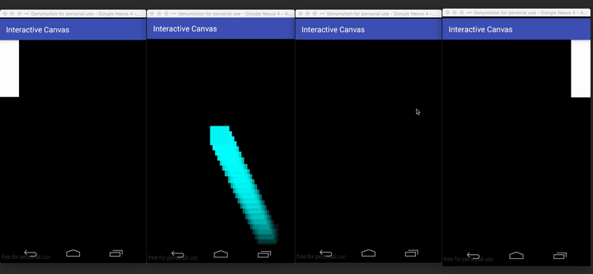
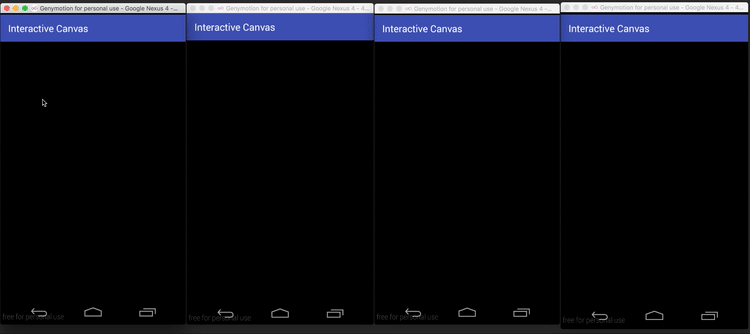

# InteractiveCanvas

The library distributes canvas animation over set of devices.

<p align="center"></p>
<p align="center"></p>

### How it works
The library is based on pretty dumb method: [`Picture`](http://developer.android.com/intl/ru/reference/android/graphics/Picture.html) class has [`writeToStream`](http://developer.android.com/reference/android/graphics/Picture.html#writeToStream(java.io.OutputStream)) and [`createFromStream`](http://developer.android.com/reference/android/graphics/Picture.html#createFromStream(java.io.InputStream)) methods which serializes and deserializes `Picture` object respectively. After serialization `byte array` sends to a client device as `UDP` packet. On a client device the packet is deserialized back into `Picture` object and finaly rendered on a `Canvas`. That's all.

### Advantages


- It's quite easy to distribute regular `Canvas` animation over almost any number of devices. You could develop and test your game (or just animation) on one device and then launch it on a set of `Android TV-sets` for instance.
- `Picture` represents a frame of animation. Size of serialized `Picture` object is relatively small: could be 100 to 300 bytes - it depends on comlexity of your animation. So there is no need to have wide bandwidth to send 30 or 60 packets(frames) per second.
- Serialization of frames and game logic execution could be performed on a separate device or even on a separate computer(with `Android` emulator/virtual machine). It could be useful when you need to perform heavy computations to prepare `Picture` frames or handle lots of users `MotionEvents`.

### Limitations

- The library uses deprecated methods. So some day it could just stop working. Though it could be used for some interactive installations or presentations where you have particular set of devices.
- Initally the libray was designed for relatively simple animation. Complex animation could overflow maximum size of `udp` packet. In this case you could either try to compress frames or send frames over `tcp`.

### Usage

1. Host side should extend [`InteractiveCanvas.java`](https://github.com/elevenetc/InteractiveCanvas/blob/master/library/src/main/java/su/levenetc/android/interactivecanvas/InteractiveCanvas.java) and override `onDraw` method:
  ```java
  @Override protected void onDraw(Canvas canvas) {
  	//...draw on canvas
  	super.onDraw(canvas);// at the end of animation `super` method must be called
  }
  ```
  
2. Then your canvas shoud be configured with array of [`Screens`](https://github.com/elevenetc/InteractiveCanvas/blob/master/library%2Fsrc%2Fmain%2Fjava%2Fsu%2Flevenetc%2Fandroid%2Finteractivecanvas%2FScreen.java). `Screen` represents client device where animation should be displayed.

  ```Java
  hostCanvas.config(screens, PICTURES_PORT, TOUCH_EVENTS_PORT);
  hostCanvas.start();
  ```

3. Client should create [`PictureReceviver`](https://github.com/elevenetc/InteractiveCanvas/blob/master/library%2Fsrc%2Fmain%2Fjava%2Fsu%2Flevenetc%2Fandroid%2Finteractivecanvas%2FPictureReceiver.java) instance and configure it with [`ReceiverView`](https://github.com/elevenetc/InteractiveCanvas/blob/master/library%2Fsrc%2Fmain%2Fjava%2Fsu%2Flevenetc%2Fandroid%2Finteractivecanvas%2FReceiverView.java) instance:
  ```java
  pictureReceiver = new PictureReceiver(clientId);
  pictureReceiver.config(PICTURES_PORT, HOST_ADDRESS, TOUCH_EVENTS_PORT);
  pictureReceiver.setReceiverView(receiverView);
  pictureReceiver.start();
  ```
  
### Samples

Ther're two samples: [`PingPongActivity`](https://github.com/elevenetc/InteractiveCanvas/blob/master/samples%2Fsrc%2Fmain%2Fjava%2Fsu%2Flevenetc%2Fandroid%2Finteractivecanvas%2Fsamples%2Fpingpong%2FPingPongActivity.java) and [`MirrorActivity`](https://github.com/elevenetc/InteractiveCanvas/blob/master/samples%2Fsrc%2Fmain%2Fjava%2Fsu%2Flevenetc%2Fandroid%2Finteractivecanvas%2Fsamples%2Fcommoncanvas%2FMirrorActivity.java). Both of the classes contain similar two static fields:

```Java
  private static final InetAddress HOST_ADDRESS = Utils.getAddress("192.168.56.101");
  private static final InetAddress[] CLIENT_ADDRESSES = new InetAddress[]{
  		HOST_ADDRESS,
  		Utils.getAddress("192.168.56.102"),
  		Utils.getAddress("192.168.56.103"),
  		Utils.getAddress("192.168.56.104")
  };
```
Change this ip adresses to id adresses of your devices and launch app on all devices.

### Download
```Groovy
repositories {
    maven { url "https://jitpack.io" }
}
//...
dependencies {
    //...
    compile 'com.github.elevenetc:interactivecanvas:0.9.0'
}
```
### Licence
http://www.apache.org/licenses/LICENSE-2.0
